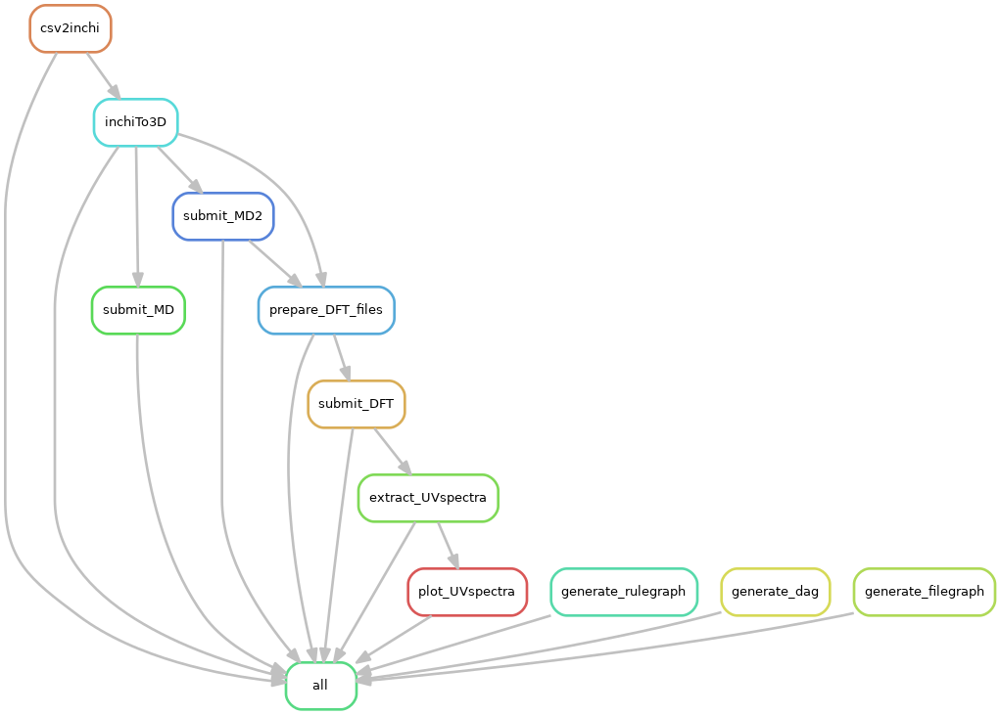

# Computational Modeling Engine (CME) architecture for automated physics-based molecular simulations

CME pipeline perform quantum mechanical simulations using computational chemistry code called NWChem (1) for geometry optimziation, chemical property prediction and computing spectral properties critical for hit identification and lead optimization in drug deisgn and discovery.

1. [Pipeline (Snakemake Workflow)](devDocs/pipeline.md)
   Computational Modeling Engine (CME) runs based of Docker container. Given a Target molecule expressed with SMILE strings, it optimized the molecules and run Time-Dependent Density Functional Theory (TD-DFT) Excited state calculatons to generate Ultraviolet–visible (UV–Vis) spectra and other molecular properties.
   
2. [Database](devDocs/database.md)
   The output of the pipeline is stored in the database.
    
3. [Backend APIs](apis/api.md)
   The set of API for developers:
     
4. [User Interface](devDocs/webapp.md)
   To helps users with interact with API.

CME Workflow:

Reference: 
1. Apra , E. et al. NWChem: Past, present, and future. The Journal of Chemical Physics
2020, 152, 184102.
