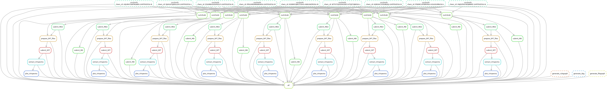

[README continued to ](../README.md)

##### Filegraph for 2 examples:

the dependency graph of rules with their input and output files


##### Execution logs for an example molecule "TUJKJAMUKRIRHC-UHFFFAOYSA-N" :
- [Final_pipeline.smk execution in JSON format(runtime statistics, provenance information) ](../logs/final_pipeline_execution.json)
- [Rule inchiTo3D's ](../logs/TUJKJAMUKRIRHC-UHFFFAOYSA-N/inchiTo3D.log)
- [Rule submit_MD's ](../logs/TUJKJAMUKRIRHC-UHFFFAOYSA-N/submit_MD.log)
- [Rule submit_MD2's execution](../logs/TUJKJAMUKRIRHC-UHFFFAOYSA-N/submit_MD2.log)
- [Rule prepare_DFT_files's logs](../logs/TUJKJAMUKRIRHC-UHFFFAOYSA-N/prepare_DFT_files.log)
- [Rule submit_DFT's logs](../logs/TUJKJAMUKRIRHC-UHFFFAOYSA-N/submit_DFT.log)
- [Rule extract_DFT_properties's logs](../logs/TUJKJAMUKRIRHC-UHFFFAOYSA-N/extract_DFT_properties.log)

------------

##### Notes (For reference purpose only):

Debian based Images:
- 0.0.0

  Took andrew's Dockerfile and Then installed `nwchem-6.8.1` and conda packages `AmberTools20, rdkit, openbabel, snakemake` from respective working channels, 
  snakemake only required bioconda channel.

- 0.0.1

  `nwchem-7.0.0` : It's build using [this base image](https://github.com/nwchemgit/nwchem-dockerfiles/tree/master/nwchem-700.mpipr )   
  Then installed conda packages `AmberTools20, rdkit, openbabel, snakemake` from respective working channels, snakemake only required
  bioconda channel.  

- 0.0.2

 I removed `continuumio/anaconda3:latest` base dependency since it uses `debian` as base OS and I can using lighter 
 anaconda(minianaconda) later in the Dockerfile2. Then installed `nwchem-6.8.1` and conda packages 
 `AmberTools20, rdkit, openbabel, snakemake` from respective working channels, snakemake 
 only required bioconda channel.

Ubuntu based Image:
- 0.0.3
    ```
    REPOSITORY                              TAG                 IMAGE ID            CREATED             SIZE
    gitlab.pnnl.gov:4567/anub229/darpacme   0.0.1               805394fea01e        5 hours ago         4.53GB
    gitlab.pnnl.gov:4567/anub229/darpacme   0.0.3               631fe794231a        5 hours ago         4.75GB
    gitlab.pnnl.gov:4567/anub229/darpacme   0.0.0               7d5425ca6067        6 hours ago         6.17GB
    gitlab.pnnl.gov:4567/anub229/darpacme   0.0.2               de78e39f80c5        6 hours ago         3.34GB
    ```     

`md_simulations` function call heirarchy:

`md.py` calls 
- `calculate_total_charge.sh`
- `batch_setupallfiles.sh` calls 
    1. `setupfiles.sh`  {create appropriate directories!} 
    2. `amber_ac.sh`    {run amber and store results!}

`md1.py` calls
- `calculate_total_charge.sh`
- `batch_setupallfiles.sbatch` calls `batch_setupallfiles.sh` calls `amber_ac.sh`

`md2.py` calls
- `batch_md0.sbatch` calls  `amber_sander_em_md0.sh`

- Incase you need to create your own virtual env locally, then follow(it's part of Dockerfile):
    ```
    # create a virtual environment:
    conda create --yes --name cme_env python=3.7
    conda activate cme_env
    
    # install packages:
    conda install --yes -c conda-forge ambertools=20.9 rdkit=2020.03.5
    conda install --yes -c openbabel openbabel=2.4.1
    conda install --yes -c bioconda -c conda-forge snakemake=5.23.0
    
    # Verify the installation:
    # 1. ambertools:
            ❯ which teleap tleap antechamber parmchk2
    #        /Users/anub229/anaconda3/envs/trial_env/bin/teleap
    #        /Users/anub229/anaconda3/envs/trial_env/bin/tleap
    #        /Users/anub229/anaconda3/envs/trial_env/bin/antechamber
    #        /Users/anub229/anaconda3/envs/trial_env/bin/parmchk2
    
    # 2. rdkit:
            ❯ python
            ❯❯❯ import rdkit as _; print(_.__path__)
    #           /Users/anub229/anaconda3/envs/trial_env/include/rdkit
            ❯❯❯ import rdkit; print(rdkit.__version__)"
    #           2020.03.5
    
    # 3. openbabel:
            ❯ obabel -V
    #         Open Babel 2.4.1 -- Sep  2 2019 -- 22:07:54
         pybel:
            ❯ python
            ❯❯❯ "import pybel; print(rdkit.__version__)"`
    #           2020.03.5
      
    # 4. snakemake:
            ❯ snakemake --version
    #         5.23.0
    ```
NWchem version with docker containers:
- 0.0.0 and 0.0.2
    ```
    mpirun -np 2 --allow-run-as-root /codes/nwchem-6.8.1/bin/LINUX64/nwchem TUJKJAMUKRIRHC-UHFFFAOYSA-N.nw
    or 
    /codes/nwchem-6.8.1/bin/LINUX64/nwchem TUJKJAMUKRIRHC-UHFFFAOYSA-N.nw
    ```
- 0.0.1 
    ```
    mpirun -np 2 /opt/nwchem-7.0.0/bin/LINUX64/nwchem TUJKJAMUKRIRHC-UHFFFAOYSA-N.nw
    ```
- 0.0.3
    ```
    mpirun -np 2 /opt/nwchem-75f3db2a2074e9158d605516009964d1a363e71f/bin/LINUX64/nwchem TUJKJAMUKRIRHC-UHFFFAOYSA-N.nw
    ```
Important environment variable:

`docker inspect --format='{{json .Config}}' <IMAGE ID>`

[Find more](../docker/inspect/inspect002.json)

```
  "Env": [
    "NWCHEM_EXECUTABLE=/opt/nwchem-6.8.1/bin/LINUX64/nwchem",
    "NWCHEM_BASIS_LIBRARY=/opt/nwchem-6.8.1/src/basis/libraries/",
    "NWCHEM_NWPW_LIBRARY=/opt/nwchem-6.8.1/src/nwpw/libraryps/",
    "LEAPRC_GAFF=/opt/conda/dat/leap/cmd/leaprc.gaff",
    "LEAPRC_FF14SB=/opt/conda/dat/leap/cmd/leaprc.ff14SB"

    "AMBER_1=/opt/nwchem-6.8.1/src/data/amber_s/",
    "AMBER_2=/opt/nwchem-6.8.1/src/data/amber_q/",
    "AMBER_3=/opt/nwchem-6.8.1/src/data/amber_x/",
    "AMBER_4=/opt/nwchem-6.8.1/src/data/amber_u/",
    "SPCE=/opt/nwchem-6.8.1/src/data/solvents/spce.rst",
    "CHARMM_S=/opt/nwchem-6.8.1/src/data/charmm_s/",
    "CHARMM_X=/opt/nwchem-6.8.1/src/data/charmm_x/",
  ]
```