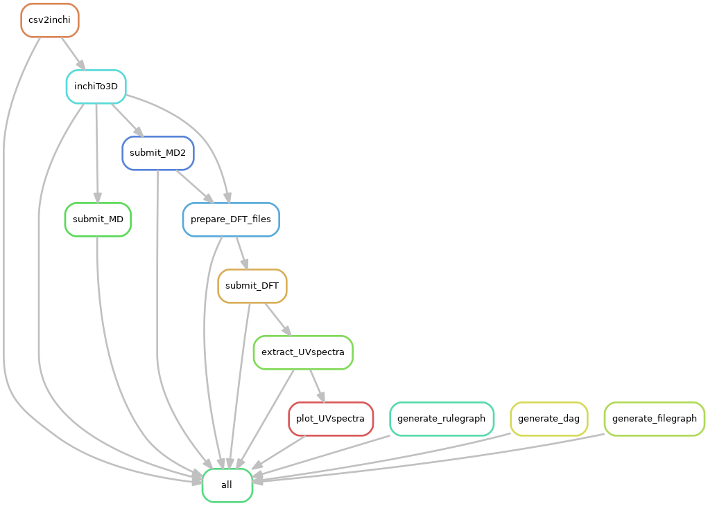

Intro to project:


```
.
├── config
                      # Template files are stored here.
├── docker
                      # Dockerfiles to build images and run containers.
├── logs
                      # Pipeline's logs.
├── results
                      # Pipeline's output.
├── src
                      # Source code lives here.
├── data
                      # CSV input files provided by user. 
├── final_pipeline.smk
                      # All rule that defined the pipeline.
                      # User need to set DATA_PATH="data/inchi.csv"  # to appropriate CSV file!
├── dft_cme.sh
                      # Start cme pipeline.
├── config.yaml
                      # Automatically generated using CSV file in data folder.
```

##### To run dockerised pipeline locally:

Note: Among all Dockerfile, I selected `Dockerfile2` because it's images has the lowest footprint `3.35GB`.

1. Build the docker image using Dockerfile2
   - Has `nwchem-6.8.1`    
   - Has conda packages `AmberTools20, rdkit, openbabel, snakemake` from respective working channels
Note: Image building might take anywhere between 15-30 minutes. You can simply skip step 1 and, start from step 2.
   ```
   $ cd /darpacme/docker/
   $ docker build --no-cache=true -t gitlab.pnnl.gov:4567/<GITLAB_USER_NAME>/darpacme:0.0.2 -f Dockerfile2 .
   ```
2. Pull existing docker image from `gitlab.pnnl.gov:4567`:
   ```
   docker login gitlab.pnnl.gov:4567
   # Username: <gitlab username>
   # Password: <gitlab password>
   docker pull gitlab.pnnl.gov:4567/anub229/darpacme:0.0.2
   docker image list
   # REPOSITORY                                           TAG                 IMAGE ID            CREATED             SIZE
   # gitlab.pnnl.gov:4567/anub229/darpacme                0.0.2               edcdd5b82500        2 days ago          3.34GB
   ```
3. Spin up a container out of `gitlab.pnnl.gov:4567/anub229/darpacme:0.0.2`:

   Note: In case you're building your own image instead of pulling existing one, you need to switch anub229 with your <GITLAB_USER_NAME>.
   
   Note: You must be in project folder `darpacme/` before running following command!
   
    ```
    $ cd /darpacme/
    $ docker run --name cmetestContainer002 \
                 -v $PWD:/entire:rw \
                 -it gitlab.pnnl.gov:4567/anub229/darpacme:0.0.2 /bin/bash
    ```
4. Run pipeline
   - The container prompt will open such as 
  
   `(base) root@878898b3b0f6:/#:`
   - Switch to mounted /entire folder in container

     `cd /entire` 
   - Start pipeline:
      - On you editor outside container, Configure the desired input file.
        - Add the desired XXXX.csv(input) file in [data](data/) folder
        - Set the DATA_PATH="data/XXXX.csv" in final_pipeline.smk
        - Set the DATA_PATH="data/XXXX.csv" in dft_cme.sh
      - Inside container, run the workflow:
      
          `bash dft_cme.sh`
       
##### To run the dockerised pipeline on cascade(using Singularity):
NOTE: If the image is already exists on a Container Registry, Jump to step 2!
1. Build and push image on PNNL's gitlab docker registery:
    ```
    # authenticate to the Container Registry by using your GitLab username and password.
      docker login gitlab.pnnl.gov:4567
    # You can add an image to this registry with the following commands:
      docker build -t gitlab.pnnl.gov:4567/anub229/darpacme:0.0.2 -f Dockerfile1 .
      docker push gitlab.pnnl.gov:4567/anub229/darpacme:0.0.2
    ```
2. Spin-up a container using singularity on Cascade
   - `ssh cascade.emsl.pnl.gov`
   Notes: below command, 
      - drop you into a container shell, with /home, /msc, and /dtemp available still.
      - needed docker-login flag since the repository is private.
      
        `singularity run --docker-login docker://gitlab.pnnl.gov:4567/anub229/darpacme:0.0.2`

3. Run pipeline
   TODO            

##### To run the pipeline on Constance without docker support:  
     ssh constance7a
     module load singularity/3.2.0
     singularity run --docker-login docker://gitlab.pnnl.gov:4567/anub229/darpacme:0.0.2
     TODO

##### To run the pipeline on cascade without docker support:
    
1. Configure environment variables to access software packages on cascade: 
    ```
    # add PYTHON path to your ~/.bashrc file, add this like to the bottom:
      vi ~/.bashrc
      export PYTHON_BIN=/home/scicons/cascade/apps/python/3.7/bin
      export PYTHONHOME=/home/scicons/cascade/apps/python/3.7
      export PYTHONPATH=/home/scicons/cascade/apps/python/3.7/lib/python3.7:/home/scicons/cascade/apps/python/3.7/include/python3.7m:/home/scicons/cascade/apps/python/3.7/pkgs
      export NECHEM7=/home/scicons/cascade/apps/nwchem-7.0.0/bin/LINUX64/nwchem    
      export PATH=${PYTHON_BIN}:${PATH}
    
    # source it:
      ❯ source ~/.bashrc
    
    # Verify the installation:
      ❯ echo -e $PYTHON_BIN "\n" $PYTHONHOME "\n" $PYTHONPATH "\n" $PATH "\n" $NECHEM7`
        ```
        /home/scicons/cascade/apps/python/3.7/bin
        /home/scicons/cascade/apps/python/3.7
        /home/scicons/cascade/apps/python/3.7/lib/python3.7:/home/scicons/cascade/apps/python/3.7/include/python3.7m:/home/scicons/cascade/apps/python/3.7/pkgs
        /home/scicons/cascade/apps/python/3.7/bin:/opt/xcat/bin:/opt/xcat/sbin:/msc/apps/compilers/intel_parallel_studio/impi/5.1.2.150/bin64:/msc/apps/compilers/intel/14.0.3/composer_xe_2013_sp1.3.174/bin/intel64:/msc/bin:/msc/cascade/bin:/msc/cascade/moab/current/bin:/home/scicons/cascade/bin:/usr/local/bin:/usr/bin:/usr/local/sbin:/usr/sbin:/opt/hpss/bin:/home/anub229/.local/bin:/home/anub229/bin
        ```
    ```
2. Further verify packages presence, If configured environment variables correctly:
    ```
      ❯ which teleap tleap antechamber parmchk2
          ```
            /home/scicons/cascade/apps/python/3.7/bin/tleap
            /home/scicons/cascade/apps/python/3.7/bin/antechamber
            /home/scicons/cascade/apps/python/3.7/bin/parmchk2
          ```
      ❯ obabel -V
        `Open Babel 3.1.0 -- May  8 2020 -- 19:17:38`
      ❯ snakemake --version
        `5.24.2`
      ❯ rdkit 
        ❯ python (must be 3.7.X version) 
        ❯❯❯ import rdkit; print(rdkit.__version__)
            `2020.03.5`
        ❯❯❯ import rdkit as _; print(_.__path__)
            `['/home/scicons/cascade/apps/python/3.7/lib/python3.7/site-packages/rdkit']`
        ❯❯❯ import pybel; print(rdkit.__version__)
            `2020.03.5`
    ```
3. Go to your project directory and run pipeline:
   ```
   cd darpacme
   bash dft_cme.sh
   ```
[README continued to ](devDocs/README.md)